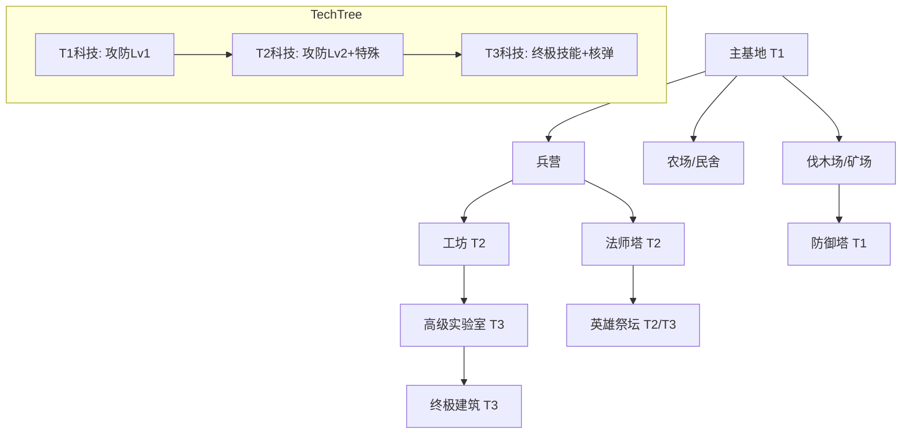

# 《裂星纪元》建造与科技系统设计

## 一、建造系统

### 1.1 建筑依赖链
游戏采用经典的线性升级与分支建造体系：

**基础层**：
- **主基地 (T1)** ➔ 生产工人、基础资源存放
  - ➔ **兵营** (基础战斗单位)
  - ➔ **民舍/补给站** (提升人口上限)
  - ➔ **资源采集场** (伐木场/农场/矿场)

**进阶层 (需升级主基地至 T2)**：
- **工坊/军械库** ➔ 研发攻防科技、生产机械/攻城单位
- **防御塔** ➔ 基础防御设施
- **法师塔/祭坛** ➔ 生产魔法单位、研发法术

**高级层 (需升级主基地至 T3)**：
- **英雄祭坛** ➔ 召唤英雄、复活英雄
- **高级实验室** ➔ 终极科技研发
- **奇迹/终极建筑** ➔ 生产终极单位 (如龙栖地、核弹井)

### 1.2 生产队列机制
- **独立队列**：每个产兵建筑拥有独立的生产队列。
- **最大堆叠**：单队列最多允许堆叠 **5** 个待产单位。
- **资源预扣**：加入队列时立即扣除资源，取消时返还 100%。

---

## 二、建筑属性表

| 建筑名称 | 级别 | 生命 | 护甲类型 | 视野 | 建造时间 | 成本 (木/粮/金) | 功能/产出 |
|----------|------|------|----------|------|----------|-----------------|-----------|
| **主基地** | T1 | 2500 | 建筑(10) | 广 | 60s | 400/0/0 | 工人生产、资源提交、科技升级、反隐形(800) |
| **兵营** | T1 | 1200 | 建筑(5) | 中 | 30s | 150/0/0 | 基础步兵、射手 |
| **农场/民舍**| T1 | 600 | 建筑(0) | 小 | 20s | 80/0/0 | 供给人口 +10 |
| **伐木场** | T1 | 800 | 建筑(0) | 小 | 25s | 100/0/0 | 提升木材效率、存放木材 |
| **防御塔** | T1 | 1000 | 建筑(5) | 广 | 35s | 120/0/50 | 远程攻击、反隐形 |
| **工坊** | T2 | 1500 | 建筑(5) | 中 | 45s | 200/50/100 | 攻城单位、机械单位 |
| **神秘圣所** | T2 | 1300 | 建筑(2) | 中 | 40s | 150/50/100 | 魔法单位、法术升级 |
| **英雄祭坛** | T3 | 2000 | 建筑(5) | 广 | 60s | 300/100/200 | 召唤/复活英雄 |
| **堡垒/龙巢**| T3 | 3000 | 建筑(10) | 广 | 90s | 500/200/400 | 终极单位生产 |

---

## 三、科技树设计

科技树分为 **通用科技** (攻防) 与 **种族特有科技**。

### 3.1 科技层级 (Tech Tiers)

#### **Layer 1 (T1 - 基础)**
1. **近战武器打磨** (Lv1-3)：提升近战单位攻击力 (+10%/级)
2. **护甲加固** (Lv1-3)：提升所有单位护甲 (+2/级)
3. **远程箭头改良** (Lv1-3)：提升远程单位攻击范围与攻击力

#### **Layer 2 (T2 - 进阶)**
1. **建筑加固**：增加所有建筑 20% 生命值与 2 点护甲。
2. **背包/携带术**：允许工人运载量 +5。
3. **药剂/维修术**：单位非战斗状态下回血/回修速度提升。

#### **Layer 3 (T3 - 终极)**
1. **种族终极技** (见下文)
2. **英雄光环精通**：英雄光环效果提升 50%。
3. **资源提炼**：黄金采集效率提升 15%。

### 3.2 种族特有科技 (分支进化)
玩家需在T2阶段选择一个**进化方向**，该选择不可逆，并决定后续 T3 科技走向。

#### **🔥 星火族 (进化方向：毁灭 vs 重生)**
- **分支 A：毁灭之炎 (Destruction)** —— 极致的进攻与AOE
  - **专属解锁**：单位 [自爆卡车]、技能 [燃油] 升级、单位 [烈焰法师] 大师级训练
  - **T2 爆燃**：所有火焰技能伤害 +30%。
  - **T3 焦土政策**：所有建筑被摧毁时对周围造成 500 点真实伤害。
  - **终极技 末日陨石**：英雄"流星陨落"范围扩大 50%，并留下持续燃烧区域。

- **分支 B：浴火重生 (Rebirth)** —— 强大的回复与战场持续力
  - **专属解锁**：单位 [凤凰]、技能 [治疗链] 效率提升、单位 [祭司] 大师级训练
  - **T2 灰烬链接**：所有友军单位每秒回复 1% 最大生命值。
  - **T3 凤凰之心**：英雄与高级单位的复活/重生冷却时间减少 50%。
  - **终极技 烈焰护佑**：全地图友军获得 15秒 免疫魔法伤害护盾 (CD 180s)。

#### **🌑 幽影族 (进化方向：暗杀 vs 腐蚀)**
- **分支 A：暗杀艺术 (Assassination)** —— 单体爆发与隐秘行动
  - **专属解锁**：单位 [潜行者] 暴击升级、单位 [黑暗骑士]、技能 [背刺] 强化
  - **T2 致命毒刃**：背刺伤害倍率从 3倍 提升至 5倍。
  - **T3 影舞步**：潜行者打破隐形后的首次攻击必定暴击。
  - **终极技 死亡标记**：标记一个敌方单位，使其受到所有伤害增加 100%。

- **分支 B：虚空腐蚀 (Corruption)** —— 群体控制与削弱
  - **专属解锁**：单位 [毁灭者]、单位 [绞肉车] 瘟疫升级、技能 [虚弱] 强化
  - **T2 精神瘟疫**：被攻击的敌人护甲 -3，攻击力 -20%。
  - **T3 恐惧降临**：所有敌方单位在夜间移动速度降低 20%。
  - **终极技 群体狂乱**：使范围内的非英雄敌军部分互相攻击，持续 5秒。

#### **⚙ 钢铁联军 (进化方向：重甲 vs 火力)**
- **分支 A：重装甲壳 (Heavy Armor)** —— 坚不可摧的防线
  - **专属解锁**：单位 [移动要塞]、单位 [蒸汽坦克] 护甲升级、技能 [盾牌] 强化
  - **T2 纳米涂层**：所有机械单位护甲 +5，且免疫毒素/流血。
  - **T3 移动堡垒**：允许坦克与重型机甲在移动中进行攻击 (精度 -20%)。
  - **终极技 铁幕**：指定区域内所有友军单位无敌 5秒。

- **分支 B：火力覆盖 (Firepower)** —— 远程压制与攻城
  - **专属解锁**：单位 [轨道炮信标]、单位 [狙击手] 射程升级、技能 [战术核弹]
  - **T2 高精弹道**：远程单位射程 +2，并没有射程惩罚。
  - **T3 贫铀弹头**：攻城攻击对非建筑单位造成 100% 伤害 (原为50%)。
  - **终极技 轨道轰炸**：无需信标，直接对视野内任意区域发动一次卫星射线打击。

---

## 四、设计总结图表

