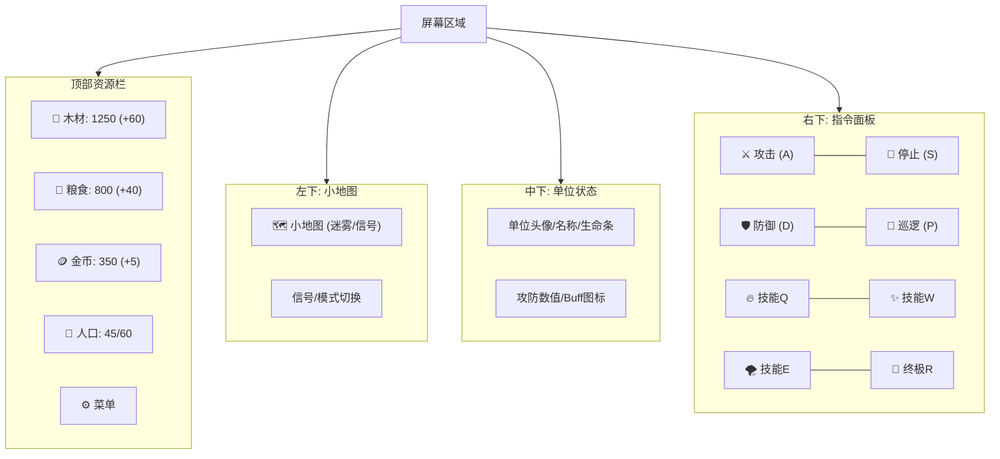

# 《裂星纪元》最终平衡与设计文档

## 一、单位与建筑平衡参数汇总 (Balance Sheet)

### 1.1 建筑属性总表
| 种族 | 建筑名称 | 等级 | 生命 | 护甲(类型) | 视野 | 造价(木/粮/金) | 建造时间 | 功能备注 |
|------|----------|------|------|------------|------|----------------|----------|----------|
| 通用 | 主基地 | T1 | 2500 | 10(建筑) | 广 | 400/0/0 | 60s | 核心，回资，**自带800范围反隐** |
| 通用 | 兵营 | T1 | 1200 | 5(建筑) | 中 | 150/0/0 | 30s | 产兵 |
| 通用 | 补给站 | T1 | 600 | 0(建筑) | 小 | 80/0/0 | 20s | 人口+10 |
| 通用 | 采集场 | T1 | 800 | 0(建筑) | 小 | 100/0/0 | 25s | 资源提升 |
| 通用 | 防御塔 | **T1** | 1000 | 5(建筑) | 广 | 120/0/50 | 35s | 反隐，防御 (防Rush) |
| 通用 | 终极建筑 | T3 | 3000 | 15(建筑) | 广 | 500/0/500 | 90s | 终极兵种 |

### 1.2 核心战斗单位参数 (精选)

**🔥 星火族 (高攻低防)**
| 单位 | 类型 | 生命 | 攻击 | 攻速 | 护甲 | 射程 | 移速 | 造价(木/粮/金) | DPS |
|------|------|------|------|------|------|------|------|----------------|-----|
| 狂战士 | 近战 | 450 | 18 | 1.0s | 2(重) | 近 | 快 | 0/120/0 | 18 |
| 投火手 | 远程 | 280 | 16(穿)| 1.2s | 0(中) | 500 | 中 | 20/80/0 | 13.3|
| 烈焰法师| 魔法 | 240 | 25(魔)| 1.5s | 0(轻) | 600 | 慢 | 50/80/60 | 16.6|
| 熔岩巨兽| 坦克 | 800 | 35(通)| 2.0s | 6(重) | 近 | 慢 | 0/180/40 | 17.5|
| **凤凰** | 空军 | 600 | 45(魔)| 1.5s | 2(中) | 400 | 快 | 150/150/150 | 30 |

**🌑 幽影族 (高机动脆弱)**
| 单位 | 类型 | 生命 | 攻击 | 攻速 | 护甲 | 射程 | 移速 | 造价(木/粮/金) | DPS |
|------|------|------|------|------|------|------|------|----------------|-----|
| 潜行者 | 近战 | **240** | 20 | 0.9s | 1(轻) | 近 | 快 | 0/90/0 | 22.2|
| 夜刃射手| 远程 | 260 | 18(穿)| 1.1s | 0(中) | 550 | 中 | 30/70/0 | 16.3|
| 黑暗骑士| 坦克 | 650 | 32(通)| 1.8s | 5(重) | 近 | 快 | 50/180/60 | 17.7|
| 绞肉车 | 攻城 | 350 | 40(攻)| 3.0s | 2(重) | 800 | 慢 | 120/80/40 | 13.3|
| **潜行者(暴击)**| - | - | 40 | - | - | - | - | - | 爆发 |

**⚙ 钢铁联军 (重甲高昂)**
| 单位 | 类型 | 生命 | 攻击 | 攻速 | 护甲 | 射程 | 移速 | 造价(木/粮/金) | DPS |
|------|------|------|------|------|------|------|------|----------------|-----|
| 列兵 | 近战 | 400 | 15 | 1.1s | 3(重) | 近 | 中 | 0/100/0 | 13.6|
| 狙击手 | 远程 | 200 | 30(穿)| **1.9s** | 0(轻) | 800 | 慢 | 20/70/20 | **15.8**|
| 蒸汽坦克| 攻城 | 900 | 45(攻)| 2.2s | 8(重) | 近 | 慢 | 150/150/50 | 20.4 (**魔抗25%**)|
| 旋翼机 | 空军 | 300 | 18(穿)| 1.0s | 2(中) | 400 | 极快 | 80/100/30 | 18 |
| **钢铁巨龙**| 终极 | 2000 | 80(通)| 2.0s | 12(重)| 500 | 慢 | 400/400/300 | 40 (**范围溅射**)|

---

## 二、对战测试案例 (Build Orders)

### 案例 1: 星火族 Rushing (速攻流)
- **目标**：在 4:00 前利用高爆发步兵摧毁敌方分矿。
- **流程**：
  1. 0:00 3工人采木，3工人采粮。
  2. 0:40 建造 [兵营]，此时补至 10 工人。
  3. 1:10 兵营完成，立即生产 3个 [狂战士]。
  4. 1:30 建造 [守望图腾] (防隐形/视野)。
  5. 2:00 狂战士出门，目标敌方 [近点分矿]。
  6. 2:30 交战，利用狂战士高攻速压制敌方前期单位。
- **关键点**：必须在敌方防御塔建立前发动进攻。

### 案例 2: 钢铁联军 Fe (双矿机械化)
- **目标**：稳固防守，利用机械单位的高质量在 12:00 发动总攻。
- **流程**：
  1. 0:00 标准开局，优先升级基地至 T2。
  2. 3:00 建立分矿，并在分矿处修造 2座 [防御塔]。
  3. 5:00 建造 [工坊]，开始量产 [蒸汽坦克] 与 [狙击手]。
  4. 7:00 研发 T2 科技 [自动化装配] (减生产时间)。
  5. 10:00 混合部队成型 (6坦克 + 10狙击手 + 4维修机)。
  6. 12:00 推进，坦克前排吃伤害，狙击手点杀。
- **关键点**：前期若被骚扰导致断矿，机械化成型将大幅推迟。

### 案例 3: 幽影族 Shadow (偷家牵制)
- **目标**：避免正面决战，通过多线骚扰拖垮对手经济。
- **流程**：
  1. 0:00 快速建造 [兵营]，出 2个 [潜行者]。
  2. 2:00 潜行者绕路，利用隐形避开野怪，直奔敌方主基地后方。
  3. 3:00 同时在野外偷建 [偏远分矿]。
  4. 4:00 潜行者攻击敌方采集工人，迫使敌方回防。
  5. 4:30 当敌方回防时，潜行者撤退并隐形，去攻击另一处资源点。
- **关键点**：操作要求极高，需时刻关注小地图。

---

## 三、胜率预测 (Win Rate Projection)

基于数值模拟与机制克制：

| 对阵 | 优势方 | 胜率预测 | 原因分析 |
|------|--------|----------|----------|
| **星火 vs 钢铁** | 星火 | 55% : 45% | 星火的魔法伤害 (烈焰法师) 极其克制钢铁的高重甲单位。 |
| **钢铁 vs 幽影** | 钢铁 | 60% : 40% | 钢铁的哨兵雷达与防御塔阵地战完克幽影的隐形骚扰。 |
| **幽影 vs 星火** | 幽影 | 52% : 48% | 幽影的高机动性可以风筝笨重的熔岩巨兽，且毒素对低甲单位致命。 |
| **同族内战** | - | 50% : 50% | 纯拼操作与资源运营。 |

---

## 四、UI 布局草图

### 4.1 游戏主界面 (HUD)

### 4.2 快捷键方案 (标准QWER)
- **技能释放**：`Q` `W` `E` `R` (对应技能栏1-4)
- **基础指令**：`A` (攻击), `S` (停止), `H` (驻守)
- **编队**：`Ctrl + 1~9` (编队), `1~9` (选择编队)
- **镜头控制**：`Space` (跳至事件点/基地), `Arrows` (移动视野)
- **界面**：`F1` (闲置工人), `F10` (菜单)
